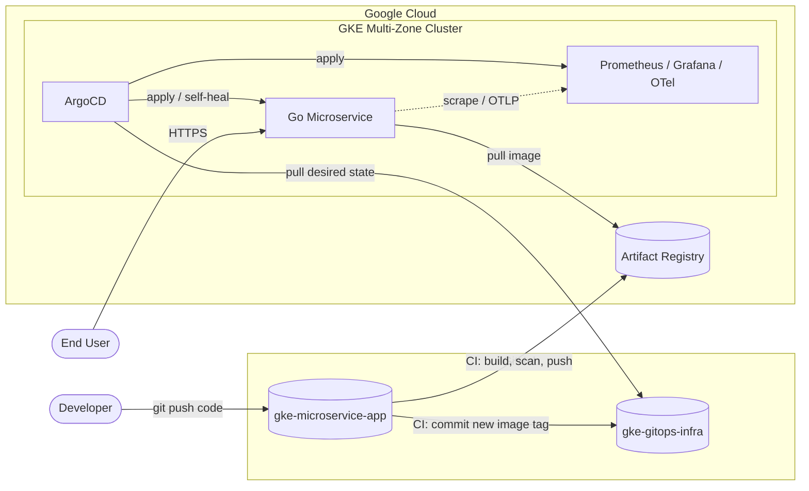
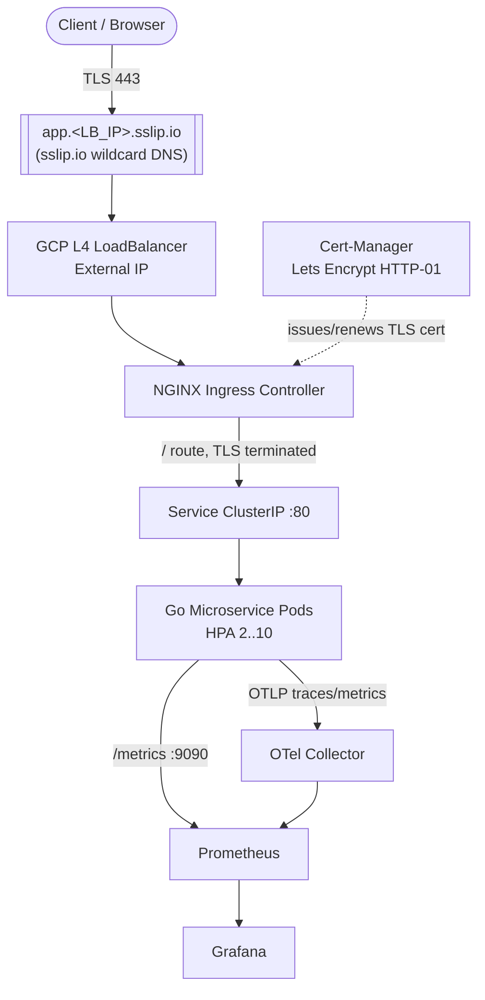
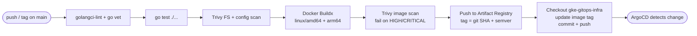
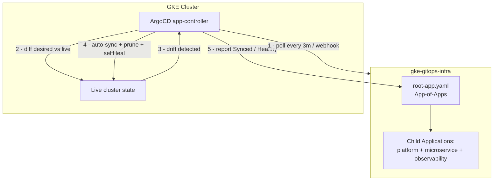

# Phase 1 — Architecture & Repository Structure

**Project:** Enterprise GitOps Deployment & Observability Pipeline on GKE
**Topology:** Polyrepo — `gke-microservice-app` (app + CI) and `gke-gitops-infra` (IaC + GitOps manifests)
**Domain strategy:** `app.<GKE_LB_IP>.sslip.io` (parameterized), Let's Encrypt HTTP-01 via NGINX Ingress.

---

## 1.1 System context (C4 level 1)



---

## 1.2 End-to-end traffic flow (request path)



The `.sslip.io` host resolves any `app.<IP>.sslip.io` name to `<IP>` with no DNS setup, so TLS + Ingress work the moment the LoadBalancer IP is assigned. Swap in a custom domain later by changing one Helm/Kustomize variable.

---

## 1.3 CI pipeline (in `gke-microservice-app`)



Authentication to GCP uses **Workload Identity Federation** (keyless OIDC) — no long-lived JSON service-account keys in GitHub secrets. The cross-repo tag bump uses a scoped deploy token / GitHub App installation token.

---

## 1.4 GitOps sync & self-healing loop (ArgoCD)



**App-of-Apps:** a single `root-app` Application points at a directory of child `Application` manifests. Bootstrapping the root app deploys the entire platform. Each child has `syncPolicy.automated` with `prune: true` and `selfHeal: true`, so any manual `kubectl edit` drift is reverted automatically.

---

## 1.5 Repository structure

### App repo — `gke-microservice-app`

```
gke-microservice-app/
├── cmd/
│   └── server/
│       └── main.go               # entrypoint, graceful shutdown, wiring
├── internal/
│   ├── handlers/
│   │   ├── api.go                # REST business endpoints
│   │   └── health.go             # /healthz, /readyz
│   ├── metrics/
│   │   └── metrics.go            # custom Prometheus collectors
│   ├── middleware/
│   │   └── observability.go      # request logging + RED metrics
│   └── telemetry/
│       └── otel.go               # OpenTelemetry tracer/meter provider
├── build/
│   └── Dockerfile                # multi-stage, distroless, non-root
├── deploy/
│   └── README.md                 # pointer to gitops repo (no manifests here)
├── .github/
│   └── workflows/
│       └── ci-cd.yaml            # lint→test→scan→build→push→tag-bump
├── go.mod
├── go.sum
├── .golangci.yml
├── .dockerignore
├── .trivyignore
└── README.md
```

### GitOps / Infra repo — `gke-gitops-infra`

```
gke-gitops-infra/
├── terraform/
│   ├── modules/
│   │   ├── vpc/                  # network, subnets, secondary ranges, NAT
│   │   ├── gke/                  # cluster + node pools + workload identity
│   │   └── iam/                  # service accounts + WI + WIF for CI
│   └── envs/
│       └── prod/
│           ├── main.tf           # composes modules
│           ├── variables.tf
│           ├── vpc.tf
│           ├── gke.tf
│           ├── iam.tf
│           ├── outputs.tf
│           ├── versions.tf       # providers + backend
│           └── terraform.tfvars.example
├── argocd/
│   ├── bootstrap/
│   │   └── root-app.yaml         # App-of-Apps root
│   └── projects/
│       └── platform-project.yaml # AppProject RBAC/allowlists
├── apps/
│   └── microservice/
│       ├── base/                 # deployment, service, ingress, hpa, kustomization
│       └── overlays/prod/        # env-specific patches + image tag
├── platform/
│   ├── ingress-nginx/            # ArgoCD App -> Helm chart + values
│   ├── cert-manager/             # ArgoCD App + ClusterIssuer
│   ├── kube-prometheus-stack/    # ArgoCD App + Helm values
│   ├── opentelemetry-collector/  # ArgoCD App + Helm values
│   └── sealed-secrets/           # ArgoCD App (secret mgmt)
├── observability/
│   ├── dashboards/               # Grafana Golden Signals JSON (as ConfigMap)
│   └── servicemonitors/          # ServiceMonitor CRDs
├── docs/
│   └── PHASE1_architecture.md
└── README.md
```

**Separation of concerns:** the app repo never contains Kubernetes manifests — its only tie to the cluster is the CI job that bumps the image tag in `apps/microservice/overlays/prod`. The GitOps repo is the single source of truth ArgoCD reconciles against.

---

## 1.6 Tech stack summary

| Layer | Choice |
|---|---|
| IaC | Terraform (modular), GCS remote state |
| Cluster | GKE, multi-zone, managed node pool + autoscaling, Workload Identity |
| App | Go — chi router, `promhttp`, OpenTelemetry SDK, `slog` JSON logs |
| Container | Multi-stage build → distroless static, non-root UID |
| CI | GitHub Actions + Workload Identity Federation, Trivy, Buildx multi-arch |
| Registry | GCP Artifact Registry |
| CD / GitOps | ArgoCD App-of-Apps, auto-sync + prune + self-heal |
| Ingress/TLS | NGINX Ingress + Cert-Manager (Let's Encrypt HTTP-01) |
| Observability | kube-prometheus-stack (Prometheus + Grafana + Alertmanager), OTel Collector |
| Secrets | Sealed Secrets (with GCP Secret Manager note) |

---

*Next: Phase 2 — modular Terraform for the GKE cluster (VPC, node pools, IAM, Workload Identity).*
